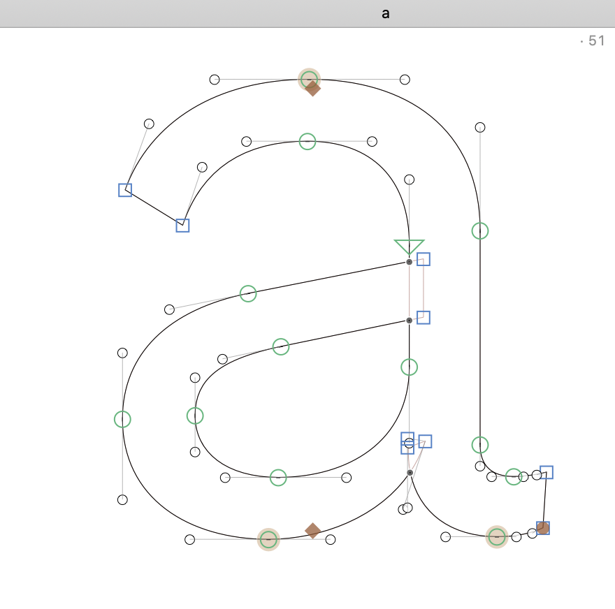

# Show Node Count In Corner

*This is a plugin for the [Glyphs font editor](http://glyphsapp.com/).*  

This is based on [Mark2Mark](https://github.com/Mark2Mark)'s [Show Node Count](https://github.com/Mark2Mark/Show-Node-Count) with the difference that the node count is displayed in the top right corner as opposed to next to the glyph.

It simply displays the current count of nodes from the currently selected path/glyph/character. It ignores components by now, which is the preferred behaviour for it’s purpose: immedeately spot a potentially incompatible master. Of course the built-in master compatibility preview in Glyphsapp is more powerfull, but not as quick in terms of counting points.

### Install

1. Install via the Plugin Manager in Glyphs.
2. Restart Glyphs.

### How to use

When ever you need it, toggle `Show * Node Count In Corner` from the view menu.

### Examples

##### Known issues

- None so far

##### Pull Requests

Feel free to comment or pull requests for any improvements.

##### License

Copyright 2015 [Mark Frömberg](http://www.markfromberg.com/) *@Mark2Mark*

Made possible with the GlyphsSDK by Georg Seifert (@schriftgestalt) and Rainer Erich Scheichelbauer (@mekkablue).

Licensed under the Apache License, Version 2.0 (the "License");
you may not use this file except in compliance with the License.
You may obtain a copy of the License at

http://www.apache.org/licenses/LICENSE-2.0

See the License file included in this repository for further details.
